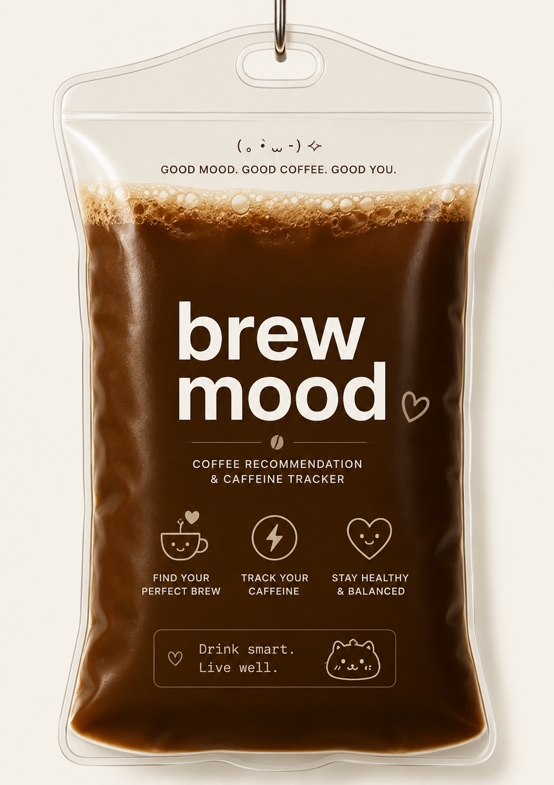

# BrewMood ☕
<p align="center">

  

</p>
A mood-based coffee recommendation and caffeine tracking program built with Python.

---

## About

BrewMood helps users discover coffee recommendations based on their mood and coffee personality.  
Users can also manually log drinks, track daily caffeine intake, and view coffee history.

This project combines practical Python programming concepts with a playful coffee-themed experience.

---

## Features

- Mood-based coffee recommendations
- Coffee personality test
- Manual drink logging
- Daily caffeine tracking
- Caffeine warning system
- View today's or all history
- Reset today's records
- JSON-based data storage

---

## Files

```text
main.py          -> Main program
coffee_data.py   -> Coffee database and recommendation map
history.json     -> Saved coffee history
```

---

## How to Run

1. Download all project files
2. Open terminal
3. Navigate to the project folder
4. Run:

```bash
python main.py
```

---

## How to Use

### Main Menu

```text
1. Start a test
2. Log a Drink
3. View history
4. Check caffeine level
5. Reset Today's Records
6. Exit
```

---

### 1. Start a Test

- Select your current mood
- Complete the coffee personality test
- Receive a personalised coffee recommendation
- Optionally log the recommended coffee

---

### 2. Log a Drink

- Manually select a coffee drink
- Automatically update caffeine intake

---

### 3. View History

- View today's coffee records
- View all saved records
- Check total caffeine intake

---

### 4. Check Caffeine Level

Displays:
- Current caffeine total
- Health warning status

---

### 5. Reset Today's Records

Clears:
- Today's caffeine total
- Today's coffee records

---

## Python Concepts Used

- Functions
- Loops
- Conditional statements
- Dictionaries
- Nested dictionaries
- Lists
- Exception handling
- File handling with JSON
- Modular programming

---

## Target Audience

Designed for students, coffee lovers, and users who want a fun way to track caffeine intake and explore coffee recommendations.

---
## Representative Features

☕ Mood-based recommendations  

✧(•̀ᴗ•́) Caffeine tracking  

ヽ(●´∀`●)ﾉ Coffee logging  

(๑´ㅂ`๑) Cozy user experience
